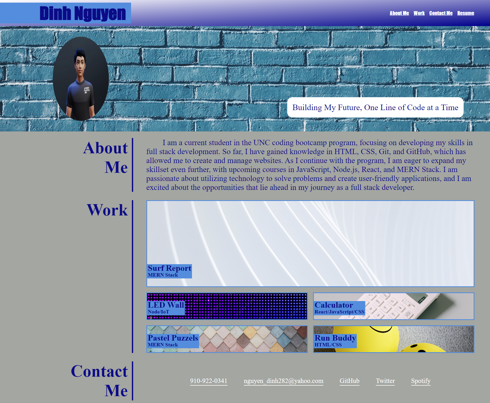

# <Dinh's-Portfolio>

## Description

This project involves the creation of my professional portfolio webpage that showcases my skills, experience, and future 
projects to potential employers and clients. The project helped me understand the relationship between HTML and CSS. Using HTML
I was able to create the structure of my page, and by linking it to CSS I was able to add style to the page and make it presentable. 
The page contains navigation links that takes the user to different section of the main page, as well as links that takes the user to 
different webpages of my future projects. For now, when the user clicks on the different images in the work section, it will just take them 
to a place holder page (https://google.com).

## Table of Contents (Optional)

N/A

## Installation

None required. Just access HTML and CSS files to examine the codes.

## Usage

1. Access the repository from https://github.com/Dinh282/dinh-professional-portfolio.git. 
2. Clone repo to local machine.
3. Examine html file with VS Code using live server extensions. 
4. Inspect element from the web browser to view and edit the website's source code.

Alternatively:
1. Visit https://dinh282.github.io/dinh-professional-portfolio/.
2. Inspect element from the web browser to view and edit the website's source code.
3. You can change the display size to examine the page's responsiveness using the page's inspector.

Image of webpage:

## Credits

1. https://unsplash.com/ (This site provided me with assets for the images used on my website).
2  https://readyplayer.me/ (This site allowed me to create my avatar).
3. https://www.w3schools.com/ (Credits to this site for helping me understand CSS codes by providing definitions and examples.)
4. https://www.youtube.com/@WebDevSimplified (The Web Dev Simplified is a helpful Youtube Channel that helped me learn various CSS concepts)
5. https://www.youtube.com/@KevinPowell (Kevin Powell Youtube Channel also have tutorials on CSS)
6. My Instructor and TAs.

## License

Please refer to the LICENSE section in the repository.

---